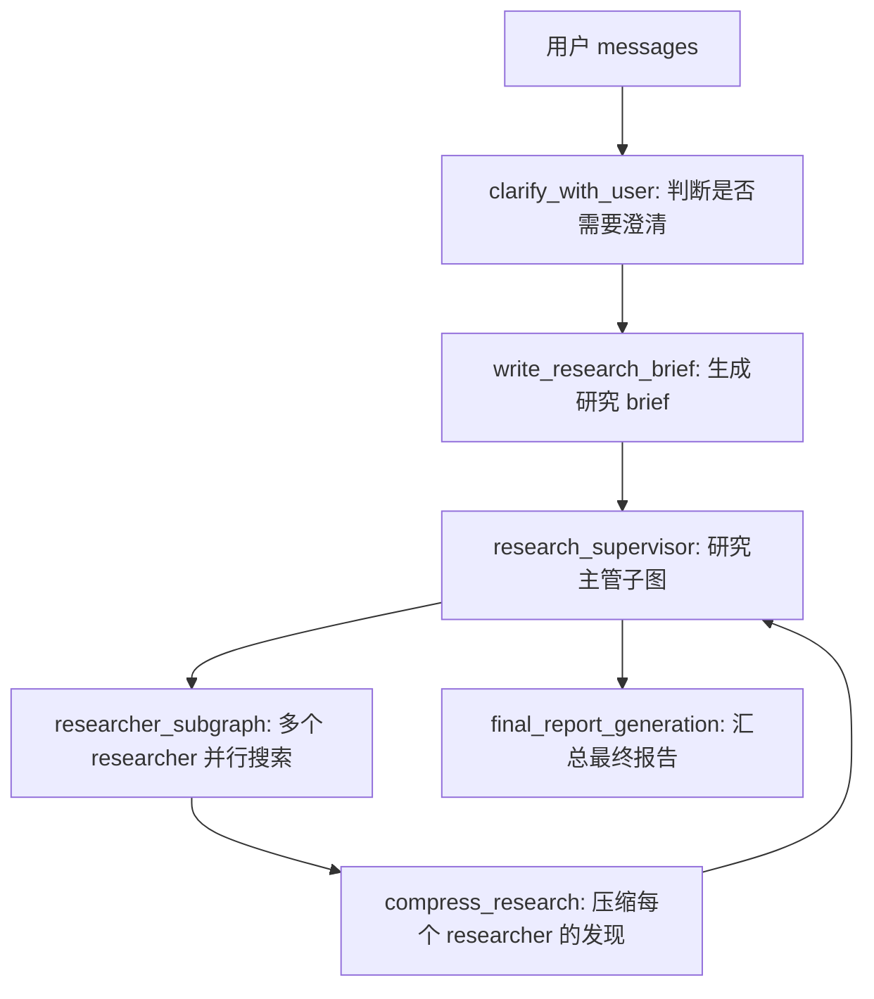

# open_deep_research源码学习（1）

## 学习目的：
以该项目为例子，可以一览基于Langgraph开源框架构建Agent的标准流程，适合对Agent有一定基础的读者梳理构建Agent的固有流程

<!--more-->

## 整体概述：

open_deep_research是基于Langgraph的一个开源项目，有文献检索，报告生成的功能。

该Agent通过编排各个有独立功能的节点或者子图来进行功能的实现，流程如下：



## 图结构搭建:

该部分是整个项目中最核心的部分，作者在此处定义了整个Agent工作流的结构和每一个节点的行为，来构建整个Graph.

并且对于每一个节点/子图，在代码层面都采用了相似的结构来确保程序的可维护性和易读性。

举一个简单的例子：

这是clarify_with_user的节点：
```python
async def clarify_with_user(state: AgentState, config: RunnableConfig) -> Command[Literal["write_research_brief", "__end__"]]:
    """Analyze user messages and ask clarifying questions if the research scope is unclear.
    
    This function determines whether the user's request needs clarification before proceeding
    with research. If clarification is disabled or not needed, it proceeds directly to research.
    
    Args:
        state: Current agent state containing user messages
        config: Runtime configuration with model settings and preferences
        
    Returns:
        Command to either end with a clarifying question or proceed to research brief
    """
    # Step 1: Check if clarification is enabled in configuration
    configurable = Configuration.from_runnable_config(config)
    if not configurable.allow_clarification:
        # Skip clarification step and proceed directly to research
        return Command(goto="write_research_brief")
    
    # Step 2: Prepare the model for structured clarification analysis
    messages = state["messages"]
    model_config = {
        "model": configurable.research_model,
        "max_tokens": configurable.research_model_max_tokens,
        "api_key": get_api_key_for_model(configurable.research_model, config),
        **get_model_provider_kwargs(configurable.research_model, configurable),
        "tags": ["langsmith:nostream"]
    }
    
    # Configure model with structured output and retry logic
    clarification_model = (
        configurable_model
        .with_structured_output(ClarifyWithUser)
        .with_retry(stop_after_attempt=configurable.max_structured_output_retries)
        .with_config(model_config)
    )

    # Step 3: Analyze whether clarification is needed
    prompt_content = clarify_with_user_instructions.format(
        messages=get_buffer_string(messages), 
        date=get_today_str()
    )
    response = await clarification_model.ainvoke([HumanMessage(content=prompt_content)])
    
    # Step 4: Route based on clarification analysis
    if response.need_clarification:
        # End with clarifying question for user
        return Command(
            goto=END, 
            update={"messages": [AIMessage(content=response.question)]}
        )
    else:
        # Proceed to research with verification message
        return Command(
            goto="write_research_brief", 
            update={"messages": [AIMessage(content=response.verification)]}
        )
```

这是write_research_brief的节点：
```python
async def write_research_brief(state: AgentState, config: RunnableConfig) -> Command[Literal["research_supervisor"]]:
    """Transform user messages into a structured research brief and initialize supervisor.
    
    This function analyzes the user's messages and generates a focused research brief
    that will guide the research supervisor. It also sets up the initial supervisor
    context with appropriate prompts and instructions.
    
    Args:
        state: Current agent state containing user messages
        config: Runtime configuration with model settings
        
    Returns:
        Command to proceed to research supervisor with initialized context
    """
    # Step 1: Set up the research model for structured output
    configurable = Configuration.from_runnable_config(config)
    research_model_config = {
        "model": configurable.research_model,
        "max_tokens": configurable.research_model_max_tokens,
        "api_key": get_api_key_for_model(configurable.research_model, config),
        **get_model_provider_kwargs(configurable.research_model, configurable),
        "tags": ["langsmith:nostream"],
    }
    
    # Configure model for structured research question generation
    research_model = (
        configurable_model
        .with_structured_output(ResearchQuestion)
        .with_retry(stop_after_attempt=configurable.max_structured_output_retries)
        .with_config(research_model_config)
    )
    
    # Step 2: Generate structured research brief from user messages
    prompt_content = transform_messages_into_research_topic_prompt.format(
        messages=get_buffer_string(state.get("messages", [])),
        date=get_today_str()
    )
    response = await research_model.ainvoke([HumanMessage(content=prompt_content)])
    
    # Step 3: Initialize supervisor with research brief and instructions
    supervisor_system_prompt = lead_researcher_prompt.format(
        date=get_today_str(),
        max_concurrent_research_units=configurable.max_concurrent_research_units,
        max_researcher_iterations=configurable.max_researcher_iterations
    )
    
    return Command(
        goto="research_supervisor", 
        update={
            "research_brief": response.research_brief,
            "supervisor_messages": {
                "type": "override",
                "value": [
                    SystemMessage(content=supervisor_system_prompt),
                    HumanMessage(content=response.research_brief)
                ]
            }
        }
    )
```

可以看出大体上代码的结构都是相似的，并且对于每部分的功能都保持了合理的抽象，非常方便进行维护。每一步注释的存在更加增强了代码的易读性

### clarify_with_user节点

第一步是对参数的处理：

```python
# Step 1: Check if clarification is enabled in configuration
configurable = Configuration.from_runnable_config(config)
if not configurable.allow_clarification:
    # Skip clarification step and proceed directly to research
    return Command(goto="write_research_brief")
```

from_runnable_config方法是Configuration.py中Config类中的一个类方法，通过该方法可以实现对configure的动态注册

```python
class Configuration(BaseModel):

......省略无关的内容

	@classmethod
	def from_runnable_config(
		cls, config: Optional[RunnableConfig] = None
	) -> "Configuration":
		"""Create a Configuration instance from a RunnableConfig."""
		configurable = config.get("configurable", {}) if config else {}
		field_names = list(cls.model_fields.keys())
		values: dict[str, Any] = {
			field_name: os.environ.get(field_name.upper(), configurable.get(field_name))
			for field_name in field_names
		}
		return cls(**{k: v for k, v in values.items() if v is not None})
```

可以看到该方法通过从Configuration中拿取字段名，然后从环境变量或者model_fields中获取对应字段名的值，最后将字段名和值放入Configuration(...)构造配置对象。

比较难以理解的是*field_names = list(cls.model_fields.keys())*，model_fields这个关键字可能让很多人摸不着头脑，实际上在pydanticV2中，所有继承BaseModel的类都会自动拥有一个类属性:model_fields.它记录了这个模型声明过的字段及其元信息，比如字段名、默认值、类型、Field(...) 里的 metadata 等

简单来说就是Pydantic自动生成的"字段注册表"，通过这种方式，当需要加入一条新的字段时，直接往Configure中传递新字段的值即可，不必再修改from_runnable_config()中的内容。

整体的流程大意如下：
- 自动拿到 Configuration 所有字段名。
- 对每个字段，先从环境变量里读，比如 RESEARCH_MODEL。
- 如果环境变量没有，就从 LangGraph runtime config 里读，比如 config["configurable"]["research_model"]。
- 最后把读到的值传给 Configuration(...) 构造配置对象。

所以它的作用是：让配置加载逻辑自动跟随 Configuration 类的字段变化。

```python
if not configurable.allow_clarification:
    # Skip clarification step and proceed directly to research
    return Command(goto="write_research_brief")
```

如果没有明确指定configurable中的allow_clarification字段，也就是不需要执行澄清操作，就通过Command函数直接跳转到write_research_brief节点。

接下来我们看该节点的下一步操作：

```python
messages = state["messages"]
model_config = {
    "model": configurable.research_model,
    "max_tokens": configurable.research_model_max_tokens,
    "api_key": get_api_key_for_model(configurable.research_model, config),
    **get_model_provider_kwargs(configurable.research_model, configurable),
    "tags": ["langsmith:nostream"]
}
    
# Configure model with structured output and retry logic
clarification_model = (
    configurable_model
    .with_structured_output(ClarifyWithUser)
    .with_retry(stop_after_attempt=configurable.max_structured_output_retries)
    .with_config(model_config)
)
```

第二步操作主要是进行模型调用过程中的配置流程，明确一些关键参数


